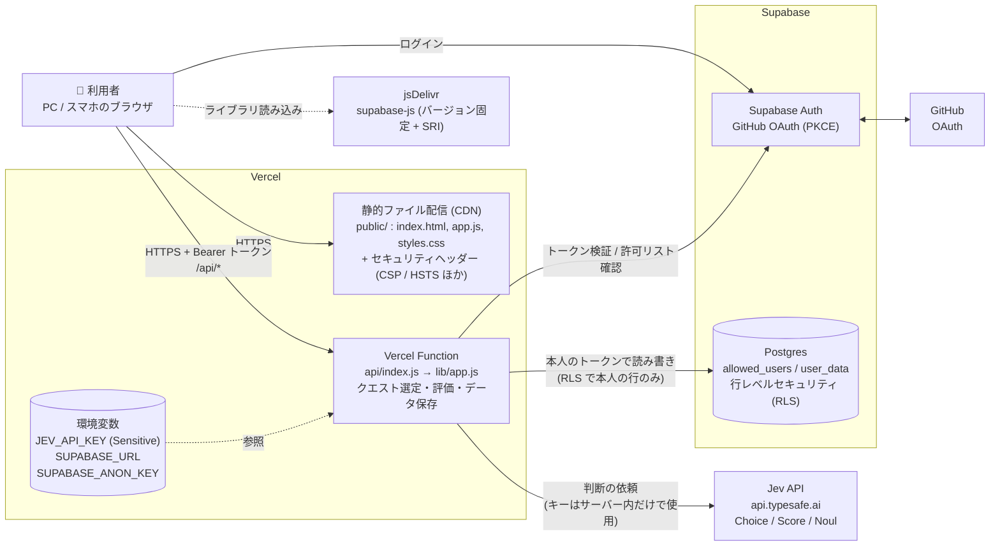
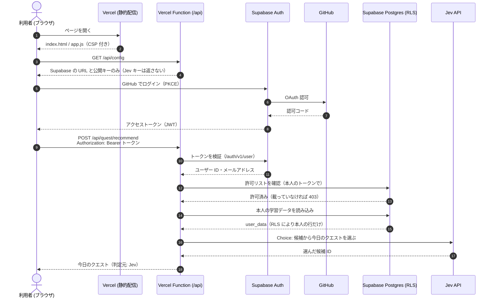
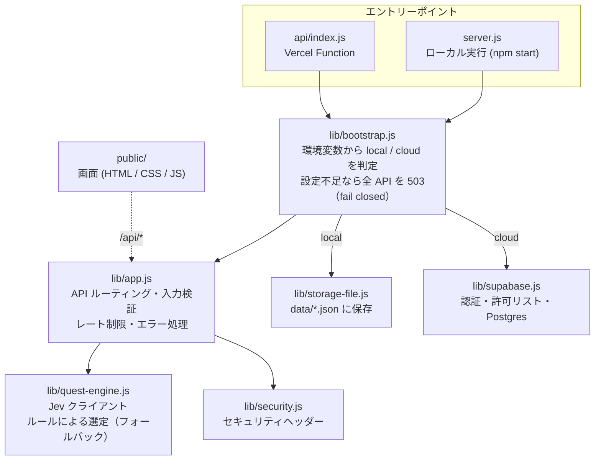

# Jev 学習クエスト (Jev Learning Quest)

**本番サイト:** https://todays-learning-quest.vercel.app/

判断AI **Jev** が「今日やる1つ」を選んでくれる学習用のWebアプリです。
**情報処理安全確保支援士の試験対策**と、**AI・クラウド・セキュリティの技術キャッチアップ**を、短い時間でも迷わず続けられるように作っています。

```
使える時間と気分を選ぶ → Jev がクエストを1つ提案 → 解いて自己採点 → Jev が理解度と復習の要否を判定
```

実行方法は2つあります。

| | クラウド版（どこからでも利用） | ローカル版（このPCだけで利用） |
| :--- | :--- | :--- |
| 動かす場所 | Vercel + Supabase | 自分のPC (`npm start`) |
| ログイン | GitHub ログイン + 許可リスト | なし（`127.0.0.1` のみで待ち受け） |
| データの保存先 | Supabase Postgres（ユーザーごとに分離） | `data/store.json` |
| Jev APIキー | Vercel の環境変数 `JEV_API_KEY` | 設定画面から保存 or 環境変数 |

---

## 構成図

### システム構成（クラウド版）



### ログインからクエスト提案まで



### コードの構成



---

## セキュリティ設計

| 脅威 | 対策 |
| :--- | :--- |
| 他人がアプリを使う・データを見る | GitHub ログイン必須。**許可リスト (`allowed_users`) に載ったメールアドレスだけ**が利用可能。API とデータベースの両方でチェック |
| 他のユーザーのデータを読み書きする | Postgres の **行レベルセキュリティ (RLS)** で「本人かつ許可済み」の行だけに制限。サーバーは **service_role キーを使わず**、利用者本人のトークンで DB にアクセスするため、サーバーのバグがあっても他人の行には届かない |
| Jev APIキーの漏えい | キーは **Vercel の環境変数（Sensitive）だけ**に置き、ブラウザ・DB・ログ・バックアップには出さない。クラウド版では画面からのキー変更や、任意のキーでの外部呼び出しはできない |
| 設定ミスで無防備に公開される | Vercel 上で Supabase の設定が足りない場合、ログインなしで動くのではなく **全 API を 503 で拒否**（fail closed） |
| XSS / 改ざんされたスクリプト | 厳格な **Content-Security-Policy**、表示時の HTML エスケープ、外部ライブラリは **バージョン固定 + SRI（ハッシュ検証）** で読み込み。`javascript:` などの危険な URL は保存しない |
| クリックジャッキング・通信の盗聴 | `X-Frame-Options: DENY` / `frame-ancestors 'none'`、HSTS で HTTPS を強制 |
| CSRF | 認証は Cookie ではなく `Authorization: Bearer` ヘッダー。POST は `application/json` のみ受け付け、CORS は許可しない |
| 大量リクエスト・高額請求 | Jev を呼ぶ API にユーザーごとのレート制限（30回/分）、Claude の添削はユーザーごとに20回/時、リクエストサイズ上限（2MB）、入力項目ごとの文字数上限 |
| Claude APIキーの漏えい | `ANTHROPIC_API_KEY` は **Vercel の環境変数（Sensitive）だけ**に置き、サーバー内でのみ使う。ブラウザには「添削が使えるかどうか」だけを返す |
| 外部サイトへの不正なリクエスト（SSRF） | AI の新着はコードに固定した公式フィードだけを取得し、利用者が URL を指定することはできない。https 以外のリンクは表示しない |
| オフライン用キャッシュからの情報漏えい | Service Worker は画面のファイルだけをキャッシュし、`/api/*` はキャッシュしない。端末に保存するのは公開教材の一問一答と、送信待ちの採点結果（問題 ID と正誤）だけ |
| 内部情報の漏えい | 500 エラーの詳細はクライアントに返さない。`.vercelignore` でローカルの `data/` をアップロードしない |

---

## クラウド版のデプロイ手順

所要時間: 20〜30分。Vercel と Supabase はどちらも無料プランで動きます。

### 1. Supabase を準備する

1. [Supabase](https://supabase.com/) で新しいプロジェクトを作る
2. **SQL Editor** で [`supabase/schema.sql`](supabase/schema.sql) の内容を貼り付けて実行する
3. 同じ SQL Editor で、**自分の GitHub アカウントのメールアドレス**を許可リストに追加する
   ```sql
   insert into public.allowed_users (email) values ('you@example.com') on conflict do nothing;
   ```
   （メールアドレスは小文字で入力してください）
4. **Project Settings → API** で次の2つを控える
   - Project URL（例: `https://xxxx.supabase.co`）→ `SUPABASE_URL`
   - Publishable key（旧 anon key）→ `SUPABASE_ANON_KEY`
   - ⚠️ `service_role` / Secret key は**使いません**。どこにも貼らないでください

### 2. GitHub ログインを有効にする

1. GitHub の **Settings → Developer settings → OAuth Apps → New OAuth App** で作成
   - Homepage URL: デプロイ後の URL（あとで変更可。仮に `https://example.com` でも可）
   - Authorization callback URL: `https://<Supabase のプロジェクト>.supabase.co/auth/v1/callback`
2. 表示された Client ID と Client Secret を、Supabase の **Authentication → Sign In / Providers → GitHub** に貼り付けて有効化
3. 同じ画面で **Email** プロバイダーは無効にしておく（GitHub ログインだけにする）

### 3. Vercel にデプロイする

1. [Vercel](https://vercel.com/new) でこのリポジトリをインポートする（Framework Preset は **Other**、ビルド設定はそのままで OK）
2. **Environment Variables** に次を登録する

   | 名前 | 値 | 備考 |
   | :--- | :--- | :--- |
   | `SUPABASE_URL` | Supabase の Project URL | |
   | `SUPABASE_ANON_KEY` | Supabase の Publishable key | ブラウザにも渡る公開用のキー |
   | `JEV_API_KEY` | Jev の APIキー | **Sensitive を有効に**する |
   | `ANTHROPIC_API_KEY` | Claude の APIキー（任意） | 記述答案の添削に使う。**Sensitive を有効に**する。未設定なら添削ボタンが無効になるだけ |

3. Deploy する（`package.json` の依存関係は Vercel が自動でインストールします）

### 4. ログイン後の戻り先を登録する

1. Supabase の **Authentication → URL Configuration** を開く
2. **Site URL** と **Redirect URLs** に、Vercel の URL（例: `https://jev-learning-quest.vercel.app`）を登録する
3. GitHub OAuth App の Homepage URL も同じ URL に更新する

### 5. 動作確認

1. Vercel の URL を開き「GitHub でログイン」
2. ログイン後、右上が「Jev 有効」になっていれば完了
3. 設定タブの「接続テスト」で Jev への接続を確認できます

許可リストに載っていないアカウントでログインすると「利用を許可されていません」と表示され、データには一切アクセスできません。

### ローカルのデータをクラウドへ移す

ローカル版の「設定 → バックアップをダウンロード」で保存した JSON を、クラウド版の「設定 → バックアップから復元」で読み込みます。

---

## ローカル版の使い方

Node.js v18 以上（v22 推奨）があれば、`npm install` なしで起動できます。
Claude による記述答案の添削を使う場合だけ、`npm install` をしてから環境変数 `ANTHROPIC_API_KEY` を設定して起動してください。

```bash
npm start
```

ブラウザで **http://localhost:3000** を開き、設定タブで Jev の APIキーを貼り付けて「保存して接続テスト」を押します。

- 無効なキー（認証エラー）は保存されません
- キーは `data/config.json`（`.gitignore` 済み、権限 0600）に保存され、画面にはマスク表示のみ
- **キーを入れなくても、アプリ内ルールで全機能を使えます**

---

## 使い方

- **今日のクエスト**: 使える時間（10〜60分）・分野・今日の気分を選ぶと、Jev がクエストを1つ提案します。「ほかの候補を見る」から変更もできます
- **教材**: アプリに同梱した教材を、試験・回・分野・問題数を選んで直接始められます
  - **一問一答（過去問5年分）**: 応用情報 午前（＝支援士の午前I）800問と支援士 午前II 250問。令和3年春期〜令和7年秋期の各問題の出題テーマから作ったオリジナル問題で、答えの下に元の過去問と解説（[応用情報技術者試験ドットコム](https://www.ap-siken.com/apkakomon.php) / [情報処理安全確保支援士試験ドットコム](https://www.sc-siken.com/sckakomon.php)）へのリンクがあります。間違えた問題は翌日、覚えた問題は3日後・7日後…と間隔をあけて再出題します
    - **形式**: 自己採点（Space で答え、Y / N で採点）と、4択（1〜4キーで選択、Enter で次へ。選択肢は同じ分野の別の問題の答えから作る）
    - **分野別の正答率**: IPA の出題範囲の中分類（ネットワーク、データベース、セキュリティなど18分野）ごとに正答率を集計。5回以上解いて正答率7割未満の分野を「弱点」とし、弱点分野だけの集中演習ができます。弱点分野は Jev にも伝わり、今日のクエストで優先されます
    - **「この問題おかしい？」**: 答えの下のボタンから報告できます。報告は教材タブにたまり、「まとめてコピー」で Issue や修正依頼に貼れる形になります
  - **支援士 午後・科目B（記述式）**: 令和3年春期〜令和7年秋期の45問。問題冊子と解答例は IPA 公式サイトの PDF へリンクするので、登録なしで演習できます
    - **キーワード照合**: 解答例のキーワードを入れると、答案に含まれているかを照合します（全角・半角の違いは吸収）。自分で登録する過去問にも採点キーワードを設定できます
    - **Claude による添削**: `ANTHROPIC_API_KEY` を設定すると、完了画面の「Claude に添削してもらう」で、総合評価・良い点・改善点・書き方の例を返します（モデルは `claude-opus-5`。安全性の理由で断られた場合はサーバー側で推奨モデルに切り替えて再実行）
  - **AI 大手のレポート・論文**: Anthropic・OpenAI・Google・Meta・Microsoft などが公開しているレポートや論文 36件。それぞれ「読むときの観点」と「書くアウトプット」付きで、「できた」で保存すると読了になり、次の未読がクエスト候補に上がります
  - **AI の新着**: OpenAI・Google DeepMind・Google Research・Google AI・Microsoft Security の公式ブログと、arXiv の「LLM × セキュリティ」の新着を自動で取得します（サーバーで6時間キャッシュ）。「素材に追加」でキャッチアップ素材になります（Anthropic は公式の RSS がないため対象外）
- **スマホ・オフライン**: ホーム画面に追加してアプリのように使えます（PWA）。オンラインのときに一問一答を最大60問端末に保存しておき、電波がないときはそれを解けます。結果は次にオンラインになったとき自動で保存されます
- **復習**: できなかった問題は数日後に再挑戦クエストとして出題されます。正解すると「克服済み」になりリストから消えます。一問一答で復習期限が来た問題もここから復習できます
- **素材を登録**: 支援士の過去問（出典と設問）や、技術記事（次の行動つき）を登録します
- **設定**: Jev の接続状態、バックアップのダウンロード / 復元

### Jev がやること

Jev は文章を生成せず、次の **判断だけ** を行います。

| 判断 | タイミング | 内容 |
| :--- | :--- | :--- |
| **Choice** | クエスト提案時 | 候補の中から今日のクエストを1つ選ぶ |
| **Score** | 結果の保存時 | 答案とメモから理解度を4段階で判定 |
| **Noul** | 結果の保存時 | 数日後に復習すべきかを判定（確率 0.5 以上で要復習） |

画面上のバッジで判断した主体が分かります: 🧠 **Jev が選定** / 📋 **ルールで選定** / ⚠️ **Jev 接続失敗 → ルールで選定**

---

## 環境変数

| 変数 | 既定値 | 説明 |
| :--- | :--- | :--- |
| `SUPABASE_URL` | なし | 設定するとクラウド版（ログイン + Supabase）で動く |
| `SUPABASE_ANON_KEY` | なし | Supabase の Publishable key（公開用） |
| `JEV_API_KEY` | なし | Jev APIキー。ローカル版では画面からの保存より優先 |
| `ANTHROPIC_API_KEY` | なし | Claude の APIキー。設定すると記述答案の添削が使える（任意） |
| `PORT` | `3000` | ローカル版の待ち受けポート |
| `HOST` | `127.0.0.1` | ローカル版の待ち受けアドレス |
| `LQ_DATA_DIR` | `./data` | ローカル版のデータ保存先 |
| `JEV_API_URL` | `https://api.typesafe.ai/v1/systemone` | Jev API のエンドポイント（テスト用） |

## ディレクトリ構成

```
.
├── api/index.js           # Vercel Function（/api/* をすべて受ける）
├── lib/
│   ├── app.js             # API ルーティング・入力検証・レート制限
│   ├── bootstrap.js       # 環境変数から local / cloud を判定
│   ├── quest-engine.js    # Jev クライアントとルールによる選定
│   ├── quiz.js            # 一問一答の出題・4択・分野別の正答率・間隔反復・報告
│   ├── review.js          # 記述答案のキーワード照合と Claude による添削
│   ├── feeds.js           # AI の新着（公式ブログ・arXiv の RSS / Atom）
│   ├── content/
│   │   ├── index.js       # 同梱教材の読み込み
│   │   ├── quiz/*.json    # 一問一答 [番号, テーマ, 問題, 答え, 分野]（ap_07_aki.json = 応用情報 令和7年秋期 など）
│   │   ├── fields.js      # 分野（小分類 → 中分類）の対応表
│   │   ├── sc-written.js  # 支援士 午後/科目B の過去問リスト（IPA の PDF へのリンク）
│   │   └── ai-readings.js # AI 大手のレポート・論文リスト
│   ├── security.js        # セキュリティヘッダー
│   ├── storage-file.js    # ローカル保存 (data/*.json)
│   ├── supabase.js        # 認証・許可リスト・Postgres 保存
│   └── initial-data.js    # 学習データの初期状態（空）と、旧バージョンのサンプルの除去
├── public/                # 画面（Vercel では CDN から配信）。sw.js / manifest.webmanifest / icon-*.png は PWA 用
├── .github/workflows/     # PR ごとに npm test を実行する GitHub Actions
├── supabase/schema.sql    # テーブル・RLS ポリシー
├── server.js              # ローカル実行用
├── vercel.json            # ルーティングとセキュリティヘッダー
└── test_verification.js   # 自動テスト (npm test)
```

## 開発・テスト

```bash
npm test
```

モックの Jev API・Supabase・Claude API・RSS を使って、ローカル版とクラウド版の両方を自動検証します（実データや本物の API、外部サイトには触れません）。PR を作ると GitHub Actions でも自動で実行されます。

- ローカル版: 素材登録、クエスト推薦、再挑戦と克服済み、一問一答の出題・採点・復習・4択・弱点分野・報告、午後/科目B の演習とキーワード照合、AI レポートの読了管理、AI の新着、PWA のファイル、APIキーの保存・マスク・削除、Jev の応答形式
- Claude 添削: モデル・フォールバック設定・送信内容（`@anthropic-ai/sdk` がインストールされている環境でのみ実行。CI では `npm install` 後に実行）
- クラウド版: 未ログイン / 偽トークン → 401、許可リスト外 → 403、本人の行への保存、Jev キーをブラウザに渡さないこと、画面からキーを変更できないこと
- 設定不足の Vercel 環境で全 API が 503 になること
- セキュリティヘッダーがローカルと `vercel.json` で一致していること

## 注意事項

- 過去問の本文や、過去問サイトの解説文は同梱していません。一問一答は出題テーマをもとにした独自の問題で、問題本文と解説はリンク先で確認してください。午後/科目B は IPA 公式の問題冊子・解答例の PDF にリンクしています
- 学習データは空の状態から始まります（以前のバージョンで入っていた【サンプル】のデータは、読み込み時に自動で取り除かれます）
- Jev の確信度は内部の判断材料としてのみ使い、正解率としては表示しません
